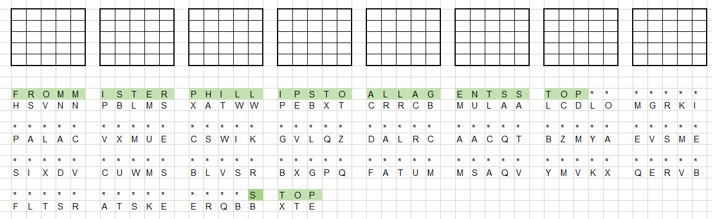

# cq_cq_cq
200

all we have is the encrypted message in the file `A_Message_from_Mr._Phillips.txt`

**Solution**:

the file name leads us to `Phillips Cipher`

we need to find the key to the initial matrix in order to decrypt the cipher text.

we known that the message from `18 -> CQ`

starts with: `FROM MISTER PHILLIPS TO ALL AGENTS STOP`

and ends with: `STOP`

so we can use this information to reverse the initial key



we can see that `S` decryped to `R` both in the first 5 letters, and the next 5 letters as well.

we can find all the options in Phillips cipher that leads to that situation, based on the the rule
that from grid 0 to grid 1 the 1st and 2nd rows are swapping.
that leads us only to 10 possible options (R is in the 3th row, or in the 4th row)
from there we continue to add more and more letters, and eliminate invalid options.
until we remain in only one possible option


the initial matrix is with the key `GATEWY`:


```
G	A	T	E	W
Y	B	C	D	F
H	I	K	L	M
N	O	P	Q	R
S	U	V	X	Z
```


so the cipher text:
```
HSVNN PBLMS XATWW PEBXT CRRCB MULAA LCDLO MGRKI
PALAC VXMUE CSWIK GVLQZ DALRC AACQT BZMYA EVSME
SIXDV CUWMS BLVSR BXGPQ FATUM MSAQV YMVKX QERVB
FLTSR ATSKE ERQBB XTE
```

is decrypted to the plain text:

```
FROMM ISTER PHILL IPSTO ALLAG ENTSS TOPTH EFLAG
ISCSA OPENC URLYB RACKE TSCLA SSICU NDERS COREC
RYPTO UNDER SCORE STRIK ESUND ERSCO REBAC KCLOS
ECURL YBRAC KETSS TOP
```

meaning:

```
From mister Phillips to all agents stop
the flag is
CSA open curly brackets CLASSIC underscore CRYPTO underscore STRIKES underscore BACK close curly brackets stop
```


**Tools**:

- https://www.dcode.fr/phillips-cipher

**Flag**:

`CSA{CLASSIC_CRYPTO_STRIKES_BACK}`
